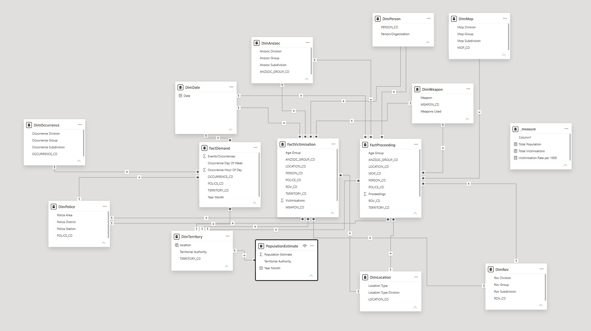
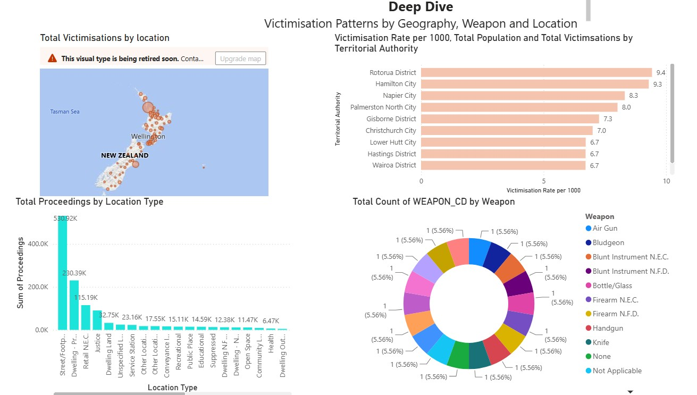

# Crime Analysis Dashboard

## Project Overview

This project presents an interactive Power BI dashboard for analysing crime patterns and victimisation data.

The project demonstrates the use of dimensional data modelling, DAX measures and data visualisation to explore crime trends across different locations, territories, police areas, crime categories and population groups.

## Business Objective

The objective is to transform crime-related data into an interactive analytical dashboard that helps users identify patterns, compare crime rates and understand changes across different dimensions.

## Tools & Technologies

- Power BI
- DAX
- Data Modelling
- Power Query
- Data Visualisation
## Data Model

The project uses a dimensional data model with multiple fact tables and supporting dimension tables.

The main fact tables include:

- FactDemand
- FactProceeding
- FactVictimisation

Supporting dimensions include location, person, police, occurrence, method of proceeding, weapon, ROV, territory and ANZSOC classifications.



## Dashboard

The Power BI dashboard provides interactive views of crime patterns, victimisation and population-adjusted crime rates.



## Key Insights

Key findings from the analysis will be documented here based on the dashboard results.
## Project Structure

```text
powerbi-crime-analysis/
├── Powerbi/
│   └── Crime_Analysis.pbix
├── README.md
├── data_model.jpg
└── overview.jpg
